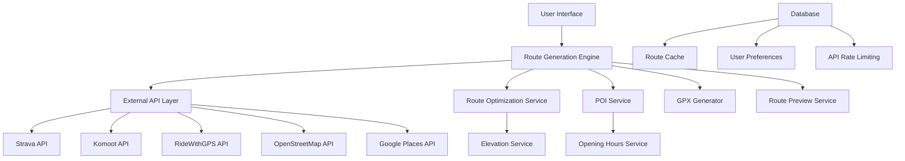

# Design Document

## Overview

The Route Builder app is an intelligent cycling route generation tool that integrates seamlessly with the existing Pedal Peak website. It leverages the established Pedal Peak design system to provide a cohesive user experience while offering advanced route planning capabilities. The application uses a clean, modern interface that prioritizes usability and visual clarity, allowing cyclists to quickly generate optimized routes based on their preferences.

The system architecture follows a modular approach with clear separation between the user interface, route generation logic, external API integrations, and data management. The design emphasizes performance, accessibility, and mobile responsiveness to ensure the tool works effectively across all devices.

## Architecture

### System Architecture



### Technology Stack

- **Frontend**: Next.js 14 with TypeScript, React 18
- **Styling**: Tailwind CSS with Pedal Peak design system
- **State Management**: React Context + useReducer for complex route state
- **Maps**: Leaflet with OpenStreetMap tiles
- **API Integration**: Custom service layer with rate limiting
- **File Generation**: Custom GPX generator
- **Database**: Existing Drizzle ORM setup
- **Deployment**: Vercel (consistent with existing setup)

### Data Flow

1. User inputs route parameters through the UI
2. Route Generation Engine validates inputs and queries external APIs
3. System aggregates data from multiple cycling platforms
4. Route Optimization Service creates optimal path considering preferences
5. POI Service adds requested points of interest with opening hours
6. GPX Generator creates downloadable file
7. Route Preview Service generates visual representation
8. Results are cached for performance

## Components and Interfaces

### Core Components

#### 1. Route Builder Form (`RouteBuilderForm`)

**Purpose**: Main input interface for route parameters
**Design**: Uses Pedal Peak card component with organized sections

```typescript
interface RouteBuilderFormProps {
  onRouteGenerate: (params: RouteParams) => void;
  isLoading: boolean;
}

interface RouteParams {
  startLocation: string;
  endLocation: string;
  rideType: 'road' | 'gravel';
  distance: {
    min: number;
    max: number;
  };
  elevation: 'flat' | 'moderate' | 'challenging';
  pointsOfInterest: POIPreference[];
}

interface POIPreference {
  type: 'bakery' | 'restaurant' | 'cafe' | 'bike_shop' | 'viewpoint';
  intervalDistance: number; // km
}
```

**Visual Design**:
- Uses `.card` class with `.card-content` sections
- Form fields styled with Pedal Peak input components
- Primary green buttons (`.btn-primary`) for actions
- Organized in logical groups with clear typography (`.heading-4`, `.body-regular`)

#### 2. Interactive Map Preview (`RouteMapPreview`)

**Purpose**: Visual route preview with interactive elements
**Design**: Full-width map with overlay controls

```typescript
interface RouteMapPreviewProps {
  route: GeneratedRoute | null;
  isLoading: boolean;
  onRouteModify?: (modifications: RouteModification[]) => void;
}

interface GeneratedRoute {
  path: LatLng[];
  distance: number;
  elevationGain: number;
  elevationLoss: number;
  estimatedTime: number;
  surfaceTypes: SurfaceBreakdown;
  pointsOfInterest: POILocation[];
}
```

**Visual Design**:
- Clean map interface with Pedal Peak color scheme
- Route path colored by surface type (green for paved, orange for gravel)
- POI markers using consistent iconography
- Overlay panel with route metrics using `.badge` components

#### 3. Route Metrics Panel (`RouteMetrics`)

**Purpose**: Display key route statistics and analytics
**Design**: Grid layout with metric cards

```typescript
interface RouteMetricsProps {
  route: GeneratedRoute;
  className?: string;
}
```

**Visual Design**:
- Uses `.grid-3` layout for responsive metric cards
- Each metric in a `.card` with icon and value
- Color-coded badges for difficulty levels
- Elevation profile chart with Pedal Peak green accent

#### 4. POI Configuration (`POISelector`)

**Purpose**: Interface for selecting and configuring points of interest
**Design**: Expandable sections with distance controls

```typescript
interface POISelectorProps {
  selectedPOIs: POIPreference[];
  onPOIChange: (pois: POIPreference[]) => void;
}
```

**Visual Design**:
- Checkbox list with POI categories
- Distance input sliders with Pedal Peak styling
- Visual indicators for opening hours status
- Uses `.badge-success`, `.badge-warning` for availability status

#### 5. Route Export Panel (`RouteExport`)

**Purpose**: GPX download and sharing options
**Design**: Action panel with download button and sharing options

```typescript
interface RouteExportProps {
  route: GeneratedRoute;
  onDownload: () => void;
  onShare?: () => void;
}
```

**Visual Design**:
- Prominent `.btn-primary` download button
- Secondary sharing options with `.btn-secondary`
- File format information with `.body-small` text
- Success states with `.badge-success`

### Service Interfaces

#### 1. Route Generation Service

```typescript
interface RouteGenerationService {
  generateRoute(params: RouteParams): Promise<GeneratedRoute>;
  optimizeRoute(route: GeneratedRoute, preferences: RoutePreferences): Promise<GeneratedRoute>;
  validateInputs(params: RouteParams): ValidationResult;
}
```

#### 2. External API Integration Service

```typescript
interface ExternalAPIService {
  getStravaHeatmap(bounds: LatLngBounds, activity: 'cycling'): Promise<HeatmapData>;
  getKomootRoute(start: LatLng, end: LatLng, profile: 'road' | 'gravel'): Promise<RouteData>;
  getRideWithGPSElevation(path: LatLng[]): Promise<ElevationData>;
  getOpeningHours(placeId: string): Promise<OpeningHours>;
}
```

#### 3. GPX Generation Service

```typescript
interface GPXService {
  generateGPX(route: GeneratedRoute, metadata: RouteMetadata): string;
  validateGPX(gpxContent: string): boolean;
  addWaypoints(gpx: string, pois: POILocation[]): string;
}
```

## Data Models

### Route Data Model

```typescript
interface GeneratedRoute {
  id: string;
  name: string;
  description?: string;
  path: LatLng[];
  distance: number; // km
  elevationGain: number; // m
  elevationLoss: number; // m
  estimatedTime: number; // minutes
  surfaceTypes: SurfaceBreakdown;
  pointsOfInterest: POILocation[];
  difficulty: 'easy' | 'moderate' | 'hard';
  rideType: 'road' | 'gravel';
  createdAt: Date;
  metadata: RouteMetadata;
}

interface SurfaceBreakdown {
  paved: number; // percentage
  gravel: number; // percentage
  trail: number; // percentage
  unknown: number; // percentage
}

interface POILocation {
  id: string;
  name: string;
  type: POIType;
  location: LatLng;
  openingHours: OpeningHours;
  distanceFromStart: number; // km
  estimatedArrivalTime: Date;
  isOpen: boolean;
  contact?: ContactInfo;
}

interface RouteMetadata {
  generatedBy: 'pedal-peak-route-builder';
  version: string;
  sources: string[]; // APIs used
  generatedAt: Date;
  preferences: RouteParams;
}
```

### User Preferences Model

```typescript
interface UserRoutePreferences {
  userId?: string;
  defaultRideType: 'road' | 'gravel';
  preferredDistance: number;
  elevationPreference: 'flat' | 'moderate' | 'challenging';
  favoritePOITypes: POIType[];
  avoidHighways: boolean;
  preferScenicRoutes: boolean;
  savedLocations: SavedLocation[];
}

interface SavedLocation {
  id: string;
  name: string;
  location: LatLng;
  type: 'home' | 'work' | 'favorite';
}
```

## Error Handling

### Error Types and Handling Strategy

```typescript
enum RouteBuilderErrorType {
  INVALID_LOCATION = 'invalid_location',
  API_RATE_LIMIT = 'api_rate_limit',
  NO_ROUTE_FOUND = 'no_route_found',
  POI_UNAVAILABLE = 'poi_unavailable',
  NETWORK_ERROR = 'network_error',
  VALIDATION_ERROR = 'validation_error'
}

interface RouteBuilderError {
  type: RouteBuilderErrorType;
  message: string;
  details?: any;
  recoverable: boolean;
  suggestedAction?: string;
}
```

### Error UI Components

- **Validation Errors**: Inline field validation with red text and icons
- **API Errors**: Toast notifications using Pedal Peak error colors
- **Network Errors**: Retry mechanisms with loading states
- **Fallback States**: Graceful degradation when external APIs fail

### Error Recovery Strategies

1. **Location Validation**: Suggest corrections for invalid addresses
2. **API Failures**: Fallback to alternative routing services
3. **POI Unavailability**: Suggest alternative POI types or locations
4. **Rate Limiting**: Queue requests and inform users of delays

## Testing Strategy

### Unit Testing

- **Component Testing**: React Testing Library for UI components
- **Service Testing**: Jest for route generation and API integration logic
- **Utility Testing**: GPX generation and validation functions
- **Error Handling**: Comprehensive error scenario testing

### Integration Testing

- **API Integration**: Mock external API responses for consistent testing
- **Route Generation**: End-to-end route creation workflows
- **File Generation**: GPX file validation and compatibility testing
- **Cross-browser**: Ensure map functionality works across browsers

### Performance Testing

- **Route Generation Speed**: Measure response times for various route complexities
- **Map Rendering**: Test performance with large route datasets
- **Memory Usage**: Monitor for memory leaks in long-running sessions
- **Mobile Performance**: Ensure smooth experience on mobile devices

### Accessibility Testing

- **Keyboard Navigation**: Full functionality without mouse
- **Screen Reader**: Proper ARIA labels and semantic HTML
- **Color Contrast**: Meet WCAG 2.1 AA standards
- **Focus Management**: Clear focus indicators and logical tab order

## User Experience Flow

### Primary User Journey

1. **Landing**: User accesses route builder from main Pedal Peak navigation
2. **Input**: User fills out route parameters form with clear guidance
3. **Generation**: System processes request with loading indicators and progress updates
4. **Preview**: Interactive map shows generated route with metrics panel
5. **Refinement**: User can adjust POI preferences or route parameters
6. **Export**: User downloads GPX file with success confirmation
7. **Integration**: User can save route to profile or share with community

### Mobile Experience Considerations

- **Touch-Friendly**: Large tap targets for map interaction
- **Responsive Layout**: Stacked layout on mobile with collapsible sections
- **Gesture Support**: Pinch-to-zoom and pan gestures on map
- **Offline Capability**: Cache generated routes for offline access

### Loading States and Feedback

- **Form Validation**: Real-time feedback on input fields
- **Route Generation**: Progress indicator with estimated completion time
- **Map Loading**: Skeleton screens while map tiles load
- **API Delays**: Informative messages about external service delays

## Integration with Existing Pedal Peak System

### Navigation Integration

- Add "Route Builder" to main navigation menu
- Include route builder CTA on relevant pages (routes, community)
- Link generated routes to existing route display system

### User Account Integration

- Save generated routes to user profiles
- Include route builder usage in user activity feeds
- Allow sharing generated routes with Pedal Peak community

### Design System Consistency

- Use existing Pedal Peak color palette and typography
- Maintain consistent spacing and component styling
- Follow established interaction patterns and animations
- Ensure accessibility standards match existing site

### Performance Considerations

- Lazy load route builder components to minimize initial bundle size
- Implement route caching to reduce API calls
- Use existing image optimization and CDN setup
- Monitor Core Web Vitals impact on overall site performance